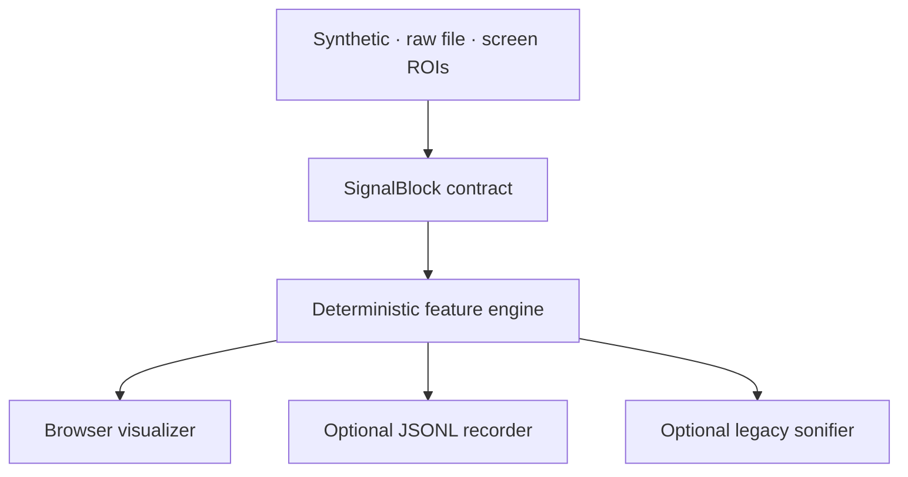

# SonicEEG modular visualizer MVP

This package separates acquisition, feature extraction, visualization, and sonification. The visualizer consumes one normalized `SignalBlock` contract, whether the source is the existing screen scraper, a deidentified raw file, or deterministic Simulation 001.

Derived frames follow the versioned [`frame.schema.json`](frame.schema.json) contract so another acquisition process can consume or produce the same representation without importing the browser or audio code.

## Start with Simulation 001

From the repository root:

```bash
pip install -r eeg_visualizer_mvp/requirements.txt
python -m eeg_visualizer_mvp --source synthetic --age 30
```

Open <http://127.0.0.1:8765>. Stop with `Ctrl+C`.

The simulator produces a deterministic 19-channel adult 10–20 recording at 256 Hz, with posterior 10-Hz alpha, lower-amplitude regional rhythms, and seeded noise. It is a software acceptance signal, not a synthetic patient diagnosis.

## Load deidentified raw EEG

CSV/TSV files need one channel per column. A column named `time`, `timestamp`, `seconds`, `sec`, or `t` lets the loader infer the sample rate:

```text
time,Fp1,Fp2,F7,F3,Fz,F4,F8,...
0.000,12.1,9.4,5.2,...
0.004,11.8,9.7,5.5,...
```

```bash
pip install -r eeg_visualizer_mvp/requirements-screen.txt
python -m eeg_visualizer_mvp \
  --source raw \
  --input /path/to/deidentified_recording.csv \
  --unit uV \
  --age 42
```

If there is no time column, add `--sample-rate 256`. NPY input must have `(channels, samples)` shape and needs `--sample-rate`; provide labels with `--channels Fp1,Fp2,...`. NPZ may contain `data`, `sample_rate`, and `channel_names` arrays.

EDF/BDF support is optional:

```bash
pip install -r eeg_visualizer_mvp/requirements-edf.txt
python -m eeg_visualizer_mvp --source raw --input recording.edf --age 42
```

The EDF/BDF adapter refuses files with populated subject-info fields. CSV/TSV/NumPy files cannot prove deidentification, so inspect them before use. The local server binds only to `127.0.0.1`; raw samples, file paths, browser details, and screenshots are not logged or written by default. For a true data-release workflow, use a format-aware anonymization tool; [MNE's anonymization documentation](https://mne.tools/stable/generated/mne.io.Raw.html) lists additional identifying fields beyond subject name alone.

## Run beside the screen scraper

The screen path reuses SonicEEG's capture, quadrant/ROI splitting, and waveform extraction. The number of seconds visible across each waveform ROI is mandatory because pixels alone do not define EEG frequency:

```bash
pip install -r eeg_visualizer_mvp/requirements-screen.txt
python -m eeg_visualizer_mvp \
  --source screen \
  --screen-seconds 10 \
  --screen-rois eeg_visualizer_mvp/example_rois.json \
  --age 42
```

Without `--uv-per-pixel`, screen-derived voltage is deliberately labeled `relative / uncalibrated` and rendered at reduced confidence. If the display calibration is known, add (for example) `--uv-per-pixel 2.0`.

ROI files map channel labels to fractional screen rectangles: `[left, top, right, bottom]`, each between 0 and 1. Replace the four example labels and rectangles with the actual display layout. The inherited four-quadrant layout cannot provide electrode localization by itself.

## Keep sonification optional

The visualization never imports or requires the sound engine. To attach the original four-quadrant WAV synthesizer as a downstream consumer:

```bash
python -m eeg_visualizer_mvp --source synthetic --sonify-dir output/sonification
```

Derived visualization frames can independently be recorded with `--record-jsonl output/frames.jsonl`. Raw samples are excluded from that file.

## Export one frame without a viewer

```bash
python -m eeg_visualizer_mvp \
  --source synthetic \
  --no-realtime \
  --export-frame output/simulation_001_frame.json
```

This proves the visualization mechanism can operate without screen scraping, a web server, or sonification.

## Deterministic visual grammar

| Visual property | Sole signal meaning |
|---|---|
| Angular sector | Fixed channel identity / region |
| Radial distance | Dominant frequency, logarithmic 0.5–45 Hz |
| Tangential displacement | Signed instantaneous voltage relative to that channel's robust scale |
| Color | Dominant canonical frequency band |
| Glyph area/luminance | Spectral concentration |
| Satellite angle | Dominant-rhythm phase |
| Outline texture | Rhythmicity |
| Opacity | Signal integrity / confidence |
| Recent trail | Short-term evolution |
| Density layer | Recurrence accumulated during this session |
| Dashed contour | Age-conditioned comparison scaffold |

Age changes only the reference contour. It does not move a measured point, rescale frequency, or alter voltage. The v0 age scaffold is intentionally marked non-diagnostic until it is replaced by validated, stratified normative models.

Its present shape is literature-informed but is not a digitized percentile model. The validation trail starts with the large lifespan cohort reported by [Sun et al. (2023)](https://pubmed.ncbi.nlm.nih.gov/36739622/), the adolescent PDR measurements reported by [Marcuse et al. (2008)](https://pubmed.ncbi.nlm.nih.gov/18486545/), and the objective descriptors required by the [ACNS EEG reporting guideline](https://www.acns.org/UserFiles/file/EEGGuideline7_finalA4416clean_v1.pdf). A future normative layer must specify state, montage/reference, acquisition conditions, age/sex strata, dataset provenance, and uncertainty before it can generate deviation scores.

## Architecture



The screen scraper is an acquisition adapter, not an analysis engine. The former prototype resampled pixels to a 44.1-kHz audio buffer before computing EEG bands; this MVP instead derives its screen sampling rate from `pixels / seconds_visible`.

## Test

No test framework is required:

```bash
python -m unittest discover -s eeg_visualizer_mvp/tests -v
```

The suite checks Simulation 001 determinism, 10-Hz recovery, amplitude recovery, age-reference isolation, raw CSV time/unit handling, screen timebase behavior, source/consumer decoupling, the local API, and optional legacy WAV output.

## Current boundary

This is a research visualization prototype—not a medical device, diagnostic display, alarm, or substitute for raw EEG review. V1 emits only signal-integrity candidates. Pain, emotion, normal-variant, seizure, and abnormality inference are intentionally absent pending labeled datasets, explicit definitions, and prospective validation.
